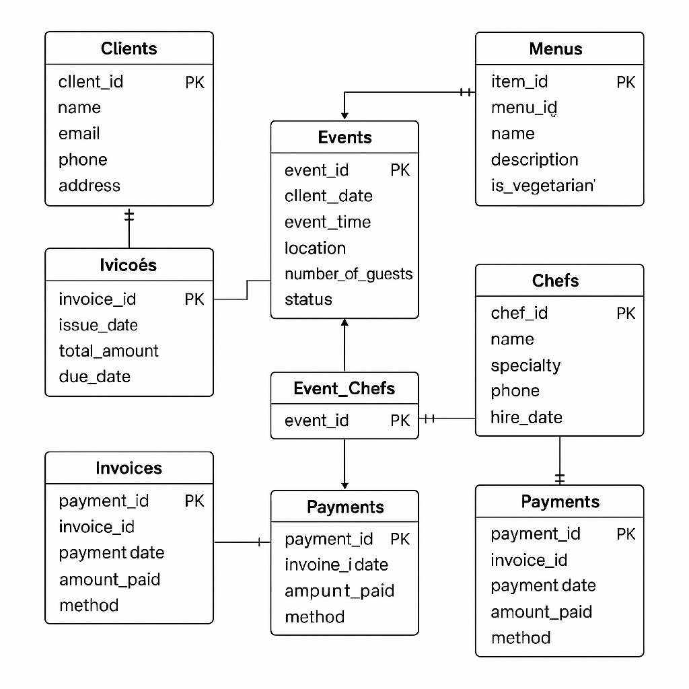

# ECMS - Event Catering Management System

## 📋 Project Title
**Event Catering Management System (ECMS)**

## 📄 Description
The **Event Catering Management System** is a relational database designed to streamline and manage key operations of a catering service, including:

- Client management  
- Event scheduling and tracking  
- Menu and menu item assignment  
- Chef allocation for events  
- Invoice and payment processing  

This database helps catering businesses maintain data integrity, improve customer service, and manage operations efficiently.

---

## 🛠️ How to Set Up the Project

### Requirements
- MySQL or compatible RDBMS (e.g., MariaDB)
- SQL client (e.g., MySQL Workbench, phpMyAdmin, or command-line)

### Steps
1. Open your SQL client or terminal.
2. Run the SQL script in the ECMS.sql file to create the `ECMS` database and its tables:

